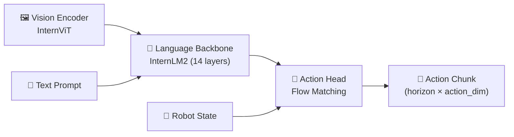
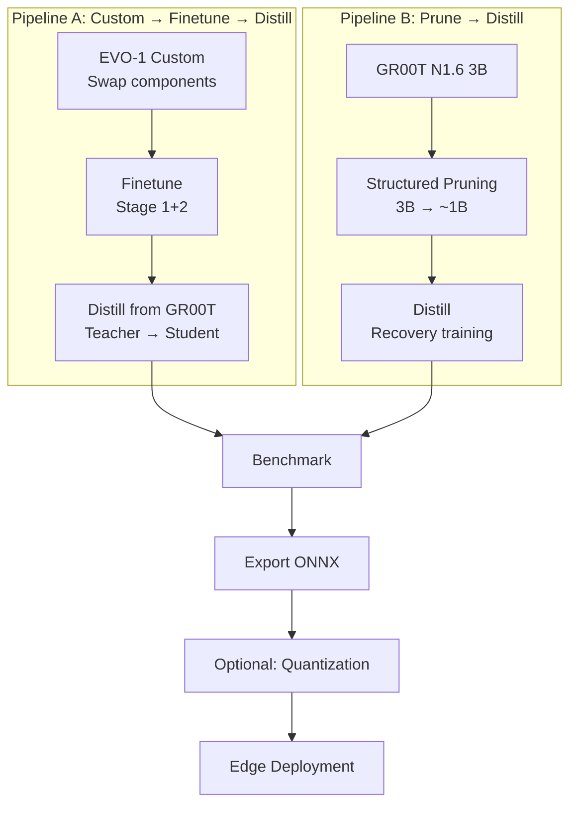

# Evo-1 VLA Research Repository — Analysis & Restructure Plan

## Phân tích hiện trạng: Repo này đang làm gì?

Evo-1 là một **Vision-Language-Action (VLA) model ~1B params** dùng cho robotic manipulation, gồm 3 thành phần chính:



### Kiến trúc hiện tại

| Component | Implementation | Details |
|---|---|---|
| Vision Encoder | `InternViT` (via InternVL3) | Trích features từ ảnh 448×448, dynamic tiling |
| Language Backbone | `InternLM2` (14/24 layers) | Fuse vision + text tokens, lấy hidden states |
| Action Head | [FlowmatchingActionHead](file:///home/kietbs/workspace/Evo-1/Evo_1/model/action_head/flow_matching.py#144-415) | 8-layer transformer, ODE integration tạo action chunk |
| Training | 2-stage paradigm | Stage 1: freeze VLM, train action head → Stage 2: full finetune |

### Cấu trúc thư mục hiện tại — Vấn đề

```
Evo-1/                          # ❌ Flat, mixed concerns
├── Evo_1/                      # Model + training + scripts + dataset ALL in one
│   ├── model/
│   │   ├── action_head/        # Flow matching only
│   │   └── internvl3/          # Embedder only
│   ├── scripts/
│   │   ├── Evo1.py             # ⚠️ Model definition in scripts/
│   │   ├── train.py            # ⚠️ 23KB monolithic training
│   │   ├── Evo1_server.py      # Inference server
│   │   └── Evo1_client_*.py    # Robot clients
│   └── dataset/                # Mixed dataset + data loading
├── Isaac-GR00T/                # 🔴 Entire GR00T repo copy
├── LIBERO_evaluation/          # Evaluation scripts
├── MetaWorld_evaluation/       # Evaluation scripts
└── so100_evo1/                 # LeRobot integration
```

> [!CAUTION]
> **Vấn đề chính:**
> 1. [Evo1.py](file:///home/kietbs/workspace/Evo-1/Evo_1/scripts/Evo1.py) (model definition) nằm trong [scripts/](file:///home/kietbs/workspace/Evo-1/Evo_1/scripts) — khó import, khó test
> 2. Training logic 23KB monolithic — không thể swap/extend
> 3. Không có abstraction cho pruning, distillation, benchmarking
> 4. GR00T repo copy nguyên xi — không modular để làm teacher
> 5. Không có config system — tất cả hardcode hoặc CLI args
> 6. Không có experiment tracking structure

---

## Proposed Repository Structure

Thiết kế theo **Layered Architecture + Registry Pattern**, tối ưu cho VLA research iteration:

```
Evo-1/
├── configs/                          # 🔧 YAML config system (Hydra/OmegaConf)
│   ├── model/
│   │   ├── evo1_base.yaml            # Original Evo-1 config
│   │   ├── evo1_custom.yaml          # Custom architecture variants
│   │   └── groot_teacher.yaml        # GR00T teacher config
│   ├── train/
│   │   ├── finetune_full.yaml
│   │   ├── finetune_partial.yaml     # freeze/unfreeze config
│   │   └── distill.yaml              # Distillation training config
│   ├── pruning/
│   │   ├── channel.yaml
│   │   ├── layer.yaml
│   │   └── attention_head.yaml
│   ├── export/
│   │   └── onnx.yaml
│   └── experiment/                   # Experiment-level configs
│       ├── exp_evo1_baseline.yaml
│       ├── exp_distill_groot2evo.yaml
│       └── exp_pruning_groot.yaml
│
├── src/                              # 🏗️ Core library (pip installable)
│   └── evo/
│       ├── __init__.py
│       ├── models/                   # ── MODEL LAYER ──
│       │   ├── __init__.py
│       │   ├── base.py               # Abstract VLAModel base class
│       │   ├── evo1.py               # EVO-1 model (refactored from scripts/)
│       │   ├── groot_wrapper.py      # GR00T as teacher (wraps Isaac-GR00T)
│       │   ├── registry.py           # Model registry pattern
│       │   ├── components/           # Swappable components
│       │   │   ├── __init__.py
│       │   │   ├── vision_encoders/  # InternViT, SigLIP, etc.
│       │   │   │   ├── base.py
│       │   │   │   ├── internvit.py
│       │   │   │   └── registry.py
│       │   │   ├── language_backbones/  # InternLM2, Qwen, etc.
│       │   │   │   ├── base.py
│       │   │   │   ├── internlm2.py
│       │   │   │   └── registry.py
│       │   │   └── action_heads/     # FlowMatching, Diffusion, MLP
│       │   │       ├── base.py
│       │   │       ├── flow_matching.py
│       │   │       └── registry.py
│       │   └── builders.py           # Build model from config
│       │
│       ├── data/                      # ── DATA LAYER ──
│       │   ├── __init__.py
│       │   ├── base.py               # Abstract dataset/dataloader
│       │   ├── lerobot_dataset.py    # LeRobot v2.1 format
│       │   ├── transforms.py         # Data augmentation
│       │   └── utils.py
│       │
│       ├── training/                  # ── TRAINING LAYER ──
│       │   ├── __init__.py
│       │   ├── trainer.py            # Base trainer (replaces monolithic train.py)
│       │   ├── finetune.py           # Full/partial finetune logic
│       │   ├── distillation/         # ⭐ Core distillation module
│       │   │   ├── __init__.py
│       │   │   ├── base.py           # Abstract distiller
│       │   │   ├── behavior_distill.py   # Action/behavior distillation
│       │   │   ├── feature_distill.py    # Feature/logit distillation
│       │   │   └── losses.py         # KL, MSE, action-space losses
│       │   ├── pruning/              # ⭐ Pruning module
│       │   │   ├── __init__.py
│       │   │   ├── base.py           # Abstract pruner
│       │   │   ├── structured.py     # Channel/layer/head pruning
│       │   │   ├── importance.py     # Importance scoring (Taylor, magnitude)
│       │   │   └── surgery.py        # Model surgery utilities
│       │   ├── losses.py             # Training losses
│       │   ├── schedulers.py         # LR schedulers
│       │   └── callbacks.py          # Logging, checkpointing, etc.
│       │
│       ├── evaluation/                # ── EVALUATION LAYER ──
│       │   ├── __init__.py
│       │   ├── benchmark.py          # Latency/memory/throughput measurement
│       │   ├── task_evaluator.py     # Task success rate
│       │   ├── metrics.py            # Behavior fidelity, smoothness, etc.
│       │   └── profiler.py           # GPU profiling utilities
│       │
│       ├── export/                    # ── DEPLOYMENT LAYER ──
│       │   ├── __init__.py
│       │   ├── onnx_export.py        # PyTorch → ONNX
│       │   ├── quantization.py       # Post-training quantization
│       │   └── edge_optimizer.py     # TensorRT/edge optimization
│       │
│       ├── serving/                   # ── SERVING LAYER ──
│       │   ├── __init__.py
│       │   ├── server.py             # WebSocket inference server
│       │   └── client.py             # Base client class
│       │
│       └── utils/                     # ── UTILITIES ──
│           ├── __init__.py
│           ├── config.py             # Config loading/validation
│           ├── checkpoint.py         # Save/load/convert checkpoints
│           ├── logging.py            # Experiment logging
│           └── distributed.py        # Multi-GPU utilities
│
├── scripts/                          # 🚀 Entry points (thin wrappers)
│   ├── train.py                      # python scripts/train.py --config configs/...
│   ├── finetune.py
│   ├── distill.py
│   ├── prune.py
│   ├── evaluate.py
│   ├── export.py
│   ├── serve.py                      # Start inference server
│   └── benchmark.py
│
├── clients/                          # 🤖 Robot-specific client scripts
│   ├── xarm6_client.py
│   ├── aloha_client.py
│   ├── so100_client.py
│   └── libero_client.py
│
├── experiments/                      # 📊 Experiment logs & results
│   ├── README.md                     # How to run experiments
│   └── results/                      # Auto-generated results
│
├── external/                         # 📦 External dependencies
│   ├── Isaac-GR00T/                  # GR00T (git submodule)
│   └── LIBERO/                       # LIBERO benchmark
│
├── tests/                            # 🧪 Unit & integration tests
│   ├── test_models.py
│   ├── test_pruning.py
│   ├── test_distillation.py
│   └── test_export.py
│
├── docs/                             # 📖 Documentation
│   ├── architecture.md
│   ├── experiments.md
│   └── deployment.md
│
├── setup.py / pyproject.toml         # Package config
├── Makefile                          # Common commands
└── README.md
```

---

## Design Patterns & Key Decisions

### 1. Registry Pattern — Swap components dễ dàng

```python
# src/evo/models/components/vision_encoders/registry.py
VISION_ENCODER_REGISTRY = {}

def register_vision_encoder(name):
    def wrapper(cls):
        VISION_ENCODER_REGISTRY[name] = cls
        return cls
    return wrapper

# Usage in config:
# model:
#   vision_encoder: "internvit"    # ← swap to "siglip" etc.
#   language_backbone: "internlm2"
#   action_head: "flow_matching"
```

### 2. Abstract Base Classes — Enforce interface

```python
# src/evo/models/base.py
class VLAModel(ABC):
    @abstractmethod
    def encode_vision(self, images, image_mask): ...
    @abstractmethod
    def encode_language(self, tokens, vision_features): ...
    @abstractmethod
    def predict_action(self, fused_features, state): ...
    @abstractmethod
    def run_inference(self, images, prompt, state): ...
```

### 3. Config-Driven Experiments — Reproducible

```yaml
# configs/experiment/exp_distill_groot2evo.yaml
defaults:
  - /model: evo1_custom
  - /train: distill

teacher:
  model: groot_n1d6
  checkpoint: /path/to/groot/weights

student:
  model: evo1_custom
  vision_encoder: internvit
  language_backbone: internlm2_14layers
  action_head: flow_matching

distillation:
  method: behavior  # behavior | feature | logit
  temperature: 4.0
  alpha: 0.7        # weight of distill loss vs task loss

training:
  max_steps: 80000
  batch_size: 16
  lr: 1e-5
```

### 4. Optimization Pipeline Flow



---

## Mapping Plan → Repo Structure

| Plan Task | Repo Location |
|---|---|
| Custom EVO-1 architecture | `src/evo/models/` + `configs/model/` |
| Vision encoder / LLM swap | `src/evo/models/components/` |
| Full vs partial finetune | `src/evo/training/finetune.py` + `configs/train/` |
| Freeze/unfreeze modules | `src/evo/models/base.py` (set_finetune_flags) |
| Structured pruning | `src/evo/training/pruning/` |
| Behavior/feature distillation | `src/evo/training/distillation/` |
| GR00T as teacher | `src/evo/models/groot_wrapper.py` |
| Latency/memory benchmark | `src/evo/evaluation/benchmark.py` |
| Task success rate | `src/evo/evaluation/task_evaluator.py` |
| ONNX export | `src/evo/export/onnx_export.py` |
| Quantization | `src/evo/export/quantization.py` |
| Edge demo | `clients/` + `src/evo/serving/` |

---

## Migration Strategy (Incremental)

Không cần refactor toàn bộ cùng lúc. Thứ tự ưu tiên:

### Phase 1: Foundation (Week 1)
- [ ] Tạo `src/evo/` package structure
- [ ] Move [Evo1.py](file:///home/kietbs/workspace/Evo-1/Evo_1/scripts/Evo1.py) → `src/evo/models/evo1.py` (refactor imports)
- [ ] Move [internvl3_embedder.py](file:///home/kietbs/workspace/Evo-1/Evo_1/model/internvl3/internvl3_embedder.py) → `src/evo/models/components/vision_encoders/`
- [ ] Move [flow_matching.py](file:///home/kietbs/workspace/Evo-1/Evo_1/model/action_head/flow_matching.py) → `src/evo/models/components/action_heads/`
- [ ] Setup `pyproject.toml` để `pip install -e .`

### Phase 2: Config System (Week 1-2)
- [ ] Integrate OmegaConf/Hydra
- [ ] Convert CLI args → YAML configs
- [ ] Refactor [train.py](file:///home/kietbs/workspace/Evo-1/Evo_1/scripts/train.py) → modular trainer

### Phase 3: Research Modules (Week 2-4)
- [ ] Implement `training/pruning/` module
- [ ] Implement `training/distillation/` module
- [ ] Implement `evaluation/benchmark.py`

### Phase 4: Deployment (Week 4+)
- [ ] ONNX export pipeline
- [ ] Quantization support
- [ ] Edge deployment utilities

## Verification Plan

### Manual Verification
- Người dùng review cấu trúc thư mục và design patterns
- Xác nhận mapping giữa plan tasks và repo locations là đầy đủ

> [!IMPORTANT]
> Đây là analysis & design document. Chưa có code changes. Cần approval trước khi bắt đầu restructure.


src/evo/
├── evaluation/
│   ├── benchmarks/              # Mỗi benchmark 1 file
│   │   ├── base.py              # Interface chung: setup_env(), run_episode(), compute_metrics()
│   │   ├── metaworld.py         # MetaWorld 50 tasks
│   │   ├── libero.py            # LIBERO 4 suites
│   │   └── robotwin.py          # Tương lai
│   ├── metrics.py               # Success rate, smoothness, etc.
│   └── benchmark_runner.py      # Chạy benchmark từ config

configs/eval/
├── metaworld.yaml               # Task list, port, num_episodes,...
├── libero.yaml
